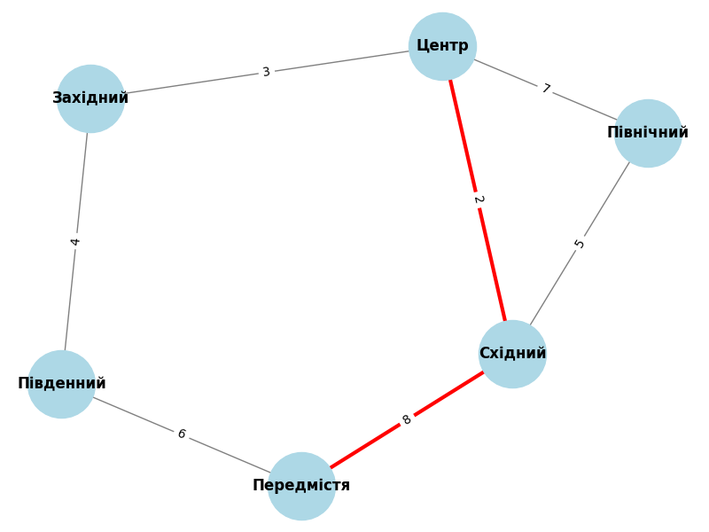

# Аналіз графа транспортної мережі міста

## Завдання 1: Створення графа

Граф моделює транспортну мережу міста, де вершини — райони, а ребра — дороги.  
Візуалізація показала, що "Центр" є основним вузлом з найбільшою кількістю зв'язків.

## Завдання 2: DFS vs BFS

- DFS дає довший, більш хаотичний шлях, бо глибше досліджує граф.
- BFS знаходить найкоротший маршрут у кількості ребер.

## Завдання 3: Алгоритм Дейкстри

- Найкоротший шлях між "Центр" і "Передмістя" → [шлях]
- Загальна відстань: [число]

Таким чином, BFS швидше за DFS у незваженому графі, а Дейкстра забезпечує найкращий шлях у зваженому графі.
